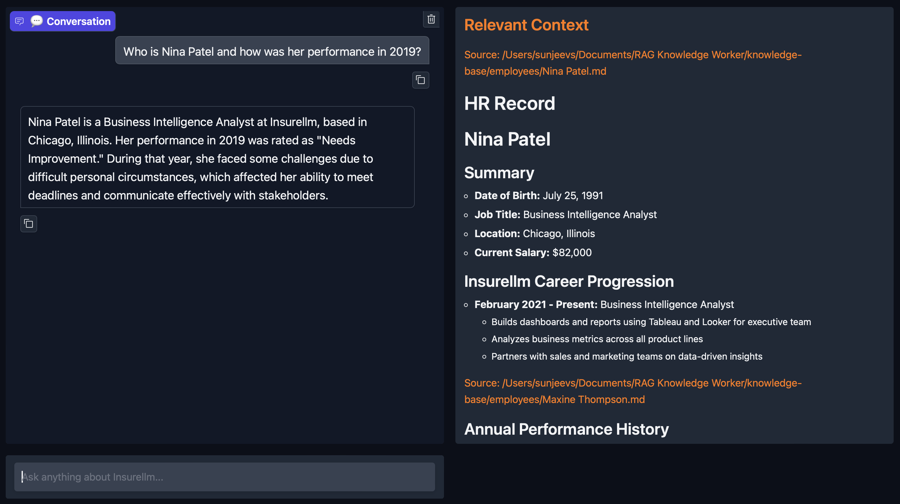
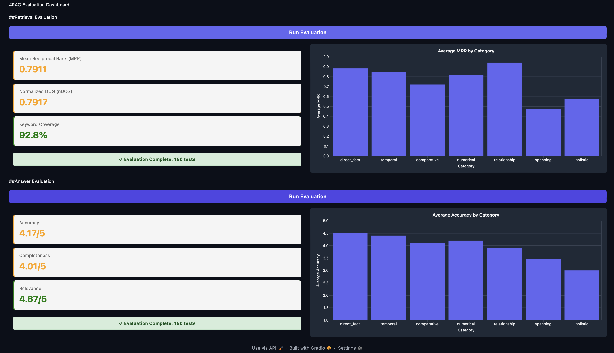

# Enterprise RAG Knowledge Assistant & Evaluation Dashboard

This is a robust Retrieval-Augmented Generation (RAG) system designed to act as an expert knowledge worker for corporate insurance data. This project implements an LLM-Ops pipeline, from automated document ingestion and vectorization to a sophisticated evaluation dashboard that measures retrieval precision and answer quality using LLM-as-a-judge.

# Key Features

**Advanced RAG Pipeline**: Utilizes text-embedding-3-large for high-dimensional semantic search and gpt-4.1-nano for context-aware response generation.

**Intelligent Ingestion**: Automated processing of markdown files with recursive character splitting and metadata tagging.

## Dual-Interface Design

**Expert Chatbot**: A polished Gradio UI for real-time conversation with full visibility into retrieved source context.

**Evaluation Dashboard**: A specialized UI for benchmarking system performance across different categories.

## Rigorous Evaluation Suite

**Retrieval Metrics**: Calculates MRR (Mean Reciprocal Rank), nDCG (Normalized Discounted Cumulative Gain), and Keyword Coverage.

**Answer Metrics**: Accuracy, Completeness, and Relevance scores (1-5 scale) judged by a secondary LLM instance.

# System Previews

1. **Expert Knowledge Assistant**



The Chatbot interface features a dual-pane view, the conversational UI on the left and the raw retrieved context on the right for full transparency.

2. **RAG Evaluation Dashboard**

 

The Dashboard visualizes retrieval performance across categories (direct fact, spanning, temporal) and provides color-coded health metrics for system accuracy.

# Tech Stack

**Orchestration**: LangChain.

**Vector Store**: ChromaDB.

**Embeddings**: OpenAI text-embedding-3-large.

**Models**: gpt-4.1-nano (via OpenAI & LiteLLM).

**UI Framework**: Gradio.

**Package Management**: uv.

# Installation and Setup

This project uses uv for lightning-fast, reproducible dependency management.

1. **Clone the Repository**

```git clone https://github.com/yourusername/rag-knowledge-worker-evals.gitcd rag-knowledge-worker-evals```

2. **Environment Setup: Create a .env file in the root directory and add your OpenAI API key**

```OPENAI_API_KEY=your_sk_key_here```

3. **Install Dependencies**

```uv sync```

# Usage Guide

**Step 1: Ingest Knowledge**

Process the files in the /knowledge-base directory and populate the vector database.

```uv run ingest.py```

**Step 2: Launch the Assistant**

Run the user-facing chatbot to interact with the insurance knowledge base.

```uv run app.py```

**Step 3: Run Evaluations**

Execute the evaluation suite to benchmark retrieval and generation quality.

```uv run evaluator.py```

# Evaluation Methodology

A RAG system is only as good as its retrieval. This project measures success using:

**MRR (Mean Reciprocal Rank)**: Evaluates how high the correct information appears in the search results.

**nDCG (Normalized Discounted Cumulative Gain)**: Measures the effectiveness of the ranking based on the position of relevant keywords.

**Multi-Dimensional Scoring**: Every answer is compared against a "Golden Reference" answer and scored on Accuracy, Completeness, and Relevance using a judge LLM which reduces hallucinations significantly.

# Project Structure

```ingest.py```: Data processing, splitting, and vectorization logic.

```answer.py```: Core RAG logic, context fetching, and LLM chain.

```eval.py```: Implementation of retrieval and answer metrics (LLM-as-a-judge).

```evaluator.py```: Gradio-based dashboard for visualizing system health.

```app.py```: Production-ready chat interface for end-users.
